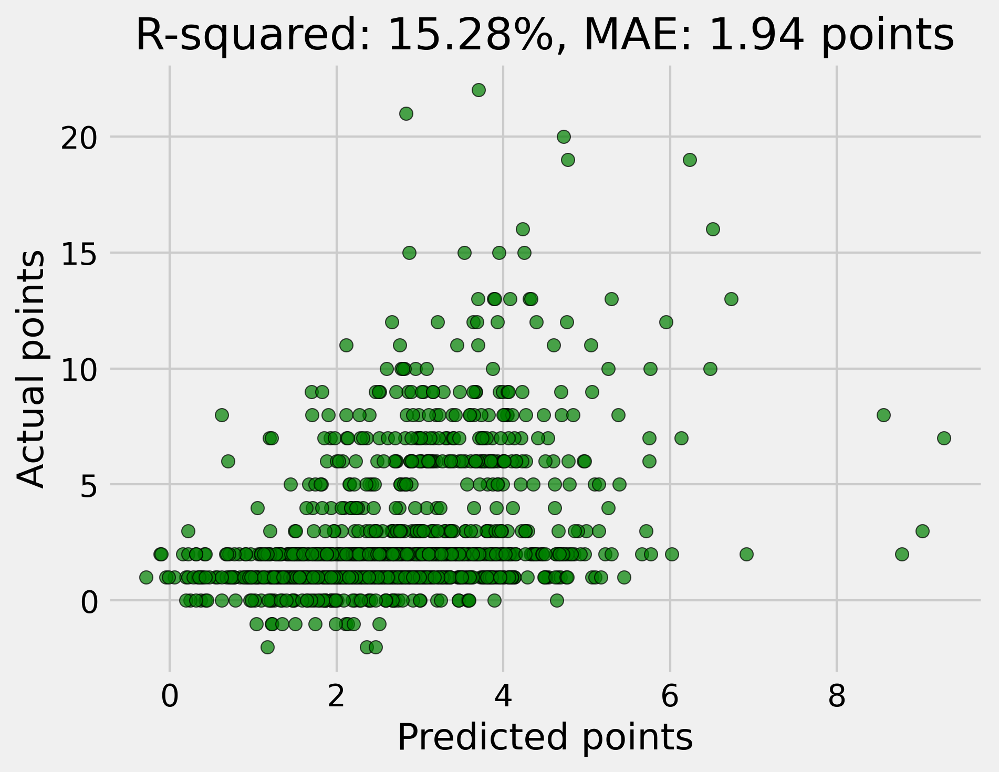

# fpl-toolkit ⚽

Jupyter Notebook tool enabling users to research, optimize, and manage their Fantasy Premier League teams.

Somehow, this tool has taken me from a mid-table mediocrity of 500K in 23/24 to a top 10K finish in 24/25. Whether that's skill or blind luck remains up for debate, but you can check out my team's history [here](https://fantasy.premierleague.com/entry/3247546/history).

[](https://mybinder.org/v2/gh/aav31/fpl-toolkit/main?urlpath=%2Fdoc%2Ftree%2Fquickstart.ipynb) to instantly check out the tool in an interactive Jupyter Notebook.

## Features


- ⬇️ **Download Team Info**: Download the information for your own FPL team.
- 📈 **Optimize Team**: Optimize your own FPL team based on a customizable expected points calculator.
- 📊 **Extract Data & Insights**: Easily extract data for each player and their clubs from the official FPL API, and gain valuable insights for your research.




## Installation
If you want to use the tool locally, follow these steps:
1. Clone the repository:
   ```bash
   git clone https://github.com/aav31/fpl-toolkit.git
   cd fpl-toolkit
   ```
2. Create the conda environment:
   ```bash
   conda env create -f environment.yml
   ```
3. Activate the environment
   ```bash
   conda activate fpl-toolkit
   ```

This will install all the necessary libraries and tools required to run the project.

## Basic Usage
Open the notebook in the usual way in the commond prompt with `jupyter notebook` or `jupyter lab` (in binder you don't need to do this) and navigate to the [Quickstart Notebook](./quickstart.ipynb) which contains some examples to get you started.

The `fpl` package contains the following modules:
- [`expected_points_calculator.py`](./fpl/expected_points_calculator.py) This module defines the ExpectedPointsCalculator class, which is an abstract base class for calculating the expected points of a player in FPL.
- [`formation.py`](./fpl/formation.py) This module defines the Formation class, which represents a valid formation of players in a Fantasy Premier League (FPL) team.
- [`loader.py`](./fpl/loader.py) This module defines the Loader class, which provides methods to fetch data from the FPL API.
- [`optimizer.py`](./fpl/optimizer.py) This module defines the Optimizer class, which provides methods to optimize FPL teams.
- [`player.py`](./fpl/player.py) This module defines the Player class, which represents a player in the Fantasy Premier League (FPL).
- [`team.py`](./fpl/team.py) This module defines the Team class, which represents a Fantasy Premier League (FPL) team.
- [`utils.py`](./fpl/utils.py) This module provides a collection of utility functions designed to support various tasks and operations across the project.

Please note, the optimizer was designed to optimize teams based purely on the expected points of each player for each gameweek; there is no attempt made to account and adjust for correlation between players. The design choice was made because a casual FPL player shouldn't need an understanding of [Modern Porfolio Theory (MPT)](https://en.wikipedia.org/wiki/Modern_portfolio_theory) to use this tool; they should be able to simply input their views on how each player should perform on an individual basis and the rest should be abstracted away. Even if you were to specify and model an entire covariance structure between all players for each gameweek, the user would still need to input a prescribed level of risk, again defeating the point of "not needing an understanding of MPT". Overall the added overhead is probably not worth; there is no point in optimization unless it can be practically used.

## License

This project is licensed under the MIT License. See the [LICENSE](LICENSE) file for more details.


## Contributing
Contributions are welcome! Feel free to open an issue or submit a pull request if you have ideas or improvements.

## Tests
Run all unit and integration tests:
```bash
python -m unittest discover -v
```
